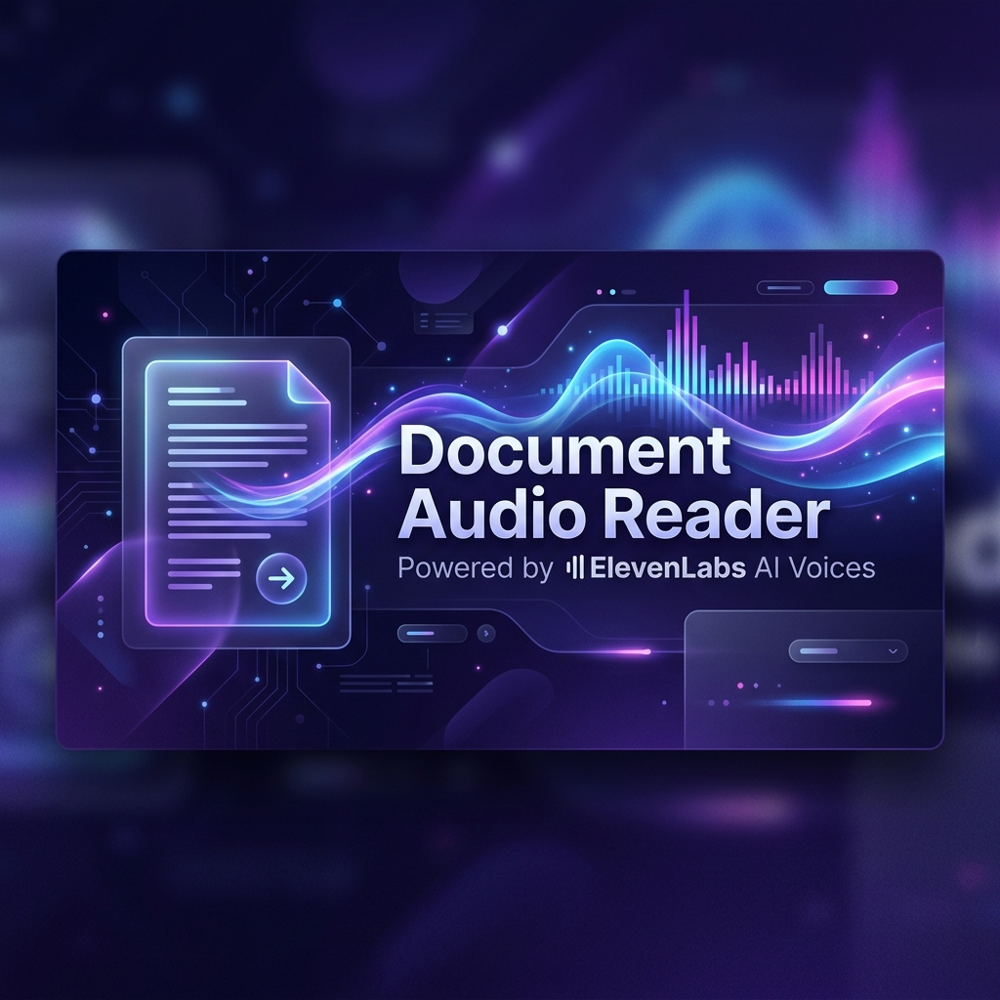

<div align="center">
  

  # Document Audio Reader

  [](https://opensource.org/licenses/MIT)
  [](https://github.com/matteoespo/doc-to-speech/actions)
  [](https://elevenlabs.io/)

  **A full-stack Document-to-Speech application that converts PDF and TXT files into ultra-realistic, lifelike audio using the ElevenLabs API.**

  **Backend:** FastAPI (Python) · **Frontend:** React + Vite + Tailwind CSS v4
</div>

---

## Prerequisites

- **Docker** and **Docker Compose** (Recommended)
- OR **Python 3.12+** and **uv** (for local development)
- **Node.js 22+** and npm (if running locally without Docker)
- An **[ElevenLabs](https://elevenlabs.io/) API key** (free tier available)

---

## Project Structure

```
doc-to-speech/
├── backend/
│   ├── main.py              # FastAPI application
│   └── requirements.txt     # Python dependencies
├── frontend/
│   ├── src/
│   │   ├── App.jsx          # React UI component
│   │   ├── index.css        # Tailwind CSS entry
│   │   └── main.jsx         # React entry point
│   ├── index.html           # HTML shell
│   ├── vite.config.js       # Vite + Tailwind config
│   ├── package.json         # Node dependencies
│   └── Dockerfile           # Frontend container
├── docker-compose.yml       # Docker services configuration
├── .env.example             # Example environment variables
└── README.md
```

---

## Quick Start

### 1. Set your ElevenLabs API key

Copy the example `.env` file and add your key:

```bash
cp .env.example .env
```

Edit `.env` to include your actual API key:
```env
ELEVENLABS_API_KEY=your-api-key-here
```

### 2. Run with Docker Compose

Start both the backend and frontend in one command:

```bash
docker-compose up --build
```

- The API will be available at **http://localhost:8000**
- The web app will be available at **http://localhost:5173**

---

## Usage

1. Open **http://localhost:5173** in your browser.
2. Drag and drop a `.pdf` or `.txt` file onto the upload area (or click to browse).
3. Click **"Read Document to Me"**.
4. Wait for the ElevenLabs API to generate the audio (a spinner will show).
5. Once ready, an audio player will appear — hit play and listen!

---

## 🎙️ Key Features

- **Text Review & Editing**: Extracted text from your PDF or TXT isn't just blindly sent to the API. It is loaded into a sleek editor where you can read, tweak, or shorten it before generating audio.
- **Dynamic Voice Selection**: Don't settle for one voice. You can instantly select between multiple premium ElevenLabs voices (George, Rachel, Drew, Clyde) right from the frontend to match the tone of your document.
- **Ultra-Realistic Intonation**: The application utilizes the `eleven_flash_v2_5` model to produce voices that naturally pause, breathe, and inflect based on context. 
- **Context-Aware Emotion**: Unlike robotic TTS of the past, ElevenLabs parses the document text to understand sentiment, delivering a reading that is genuinely engaging to listen to.
- **High-Speed Streaming Compatibility**: The backend consumes the audio data as an iterator and streams it back to the client instantly, showcasing ElevenLabs' incredibly low-latency speech generation API.

---

## API Reference

### `POST /api/extract-text`

Accepts a file upload and returns the extracted text.

| Parameter | Type       | Description                    |
| --------- | ---------- | ------------------------------ |
| `file`    | `UploadFile` | A `.pdf` or `.txt` file      |

**Response:** `{"text": "extracted document text..."}`

### `POST /api/generate-audio`

Accepts JSON data with the text and desired voice ID, returning an MP3 audio stream.

| Parameter  | Type   | Description                                      |
| ---------- | ------ | ------------------------------------------------ |
| `text`     | `str`  | The text to be spoken (max 2000 chars)           |
| `voice_id` | `str`  | The ElevenLabs Voice ID (default: George's ID)   |

**Response:** `audio/mpeg` (MP3 streaming binary)

**Constraints:**
- Text is truncated to the first **2,000 characters** before conversion.
- Only `.pdf` and `.txt` files are accepted.

---

## Configuration

| Environment Variable   | Required | Description                                |
| ---------------------- | -------- | ------------------------------------------ |
| `ELEVENLABS_API_KEY`   | Yes      | Your ElevenLabs API key                    |

The backend uses the **`eleven_flash_v2_5`** model with the **George** voice (`JBFqnCBsd6RMkjVDRZzb`) by default. You can change the voice and model in `backend/main.py`.

---

## Tech Stack

| Layer    | Technology                                              |
| -------- | ------------------------------------------------------- |
| Backend  | Python 3.12+, FastAPI, Uvicorn, PyPDF2, ElevenLabs SDK  |
| Frontend | React 19, Vite, Tailwind CSS v4                         |
| TTS      | ElevenLabs API (`eleven_flash_v2_5`)                    |

---

## License

MIT
